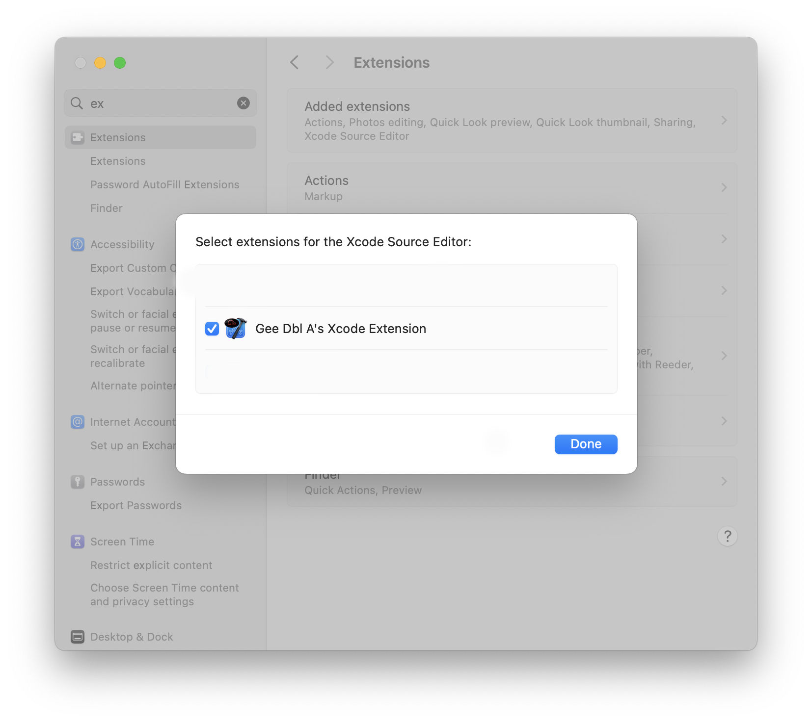

# XcodeGeeDblA

An Xcode Source Editor Extension for macOS that provides convenient source code formatting and file header management tools for Swift, C, C++, and Objective-C files.



## Features

### Header Management

- **Update File Header** — Automatically updates the "Modified" date in file headers while preserving the "Created" date and intelligently handling copyright year ranges (e.g., 2024–2026)

### Comment Formatting

- **Insert Separator Comment** — Inserts a horizontal line comment (`/*----...----*/`)
- **Insert Asterisk Box Comment** — Creates a decorative comment box with asterisks
- **Insert Dash Box Comment** — Creates a decorative comment box with dashes
- **Insert Equals Sign Box Comment** — Creates a decorative comment box with equals signs

### Debugging Utilities

- **Insert Function Trace Comment** — Automatically adds `print("# Gee Dbl A: Entering functionName()")` statements to all functions in the file
- **Remove Function Trace Comment** — Removes previously added function trace comments

### Configuration App

The companion macOS application allows you to maintain a list of copyright holders that the extension recognizes when updating file headers.

## Supported File Types

- Swift source files (`.swift`)
- Swift Playgrounds
- C/C++ source and header files (`.c`, `.cpp`, `.h`, `.hpp`)
- Objective-C source files (`.m`, `.mm`)
- Xcode strings files

## Requirements

- macOS (recent versions)
- Xcode

## Installation

1. Download the latest release or build from source
2. Move `XcodeGeeDblA.app` to your Applications folder
3. Launch the app once to register the extension
4. Enable the extension in **System Settings → Privacy & Security → Extensions → Xcode Source Editor**
5. Restart Xcode

## Usage

1. Open any supported source file in Xcode
2. Select **Editor → XcodeGeeDblA** from the menu bar
3. Choose the desired command

You can also assign keyboard shortcuts to these commands via **Xcode → Settings → Key Bindings**.

## Building from Source

```bash
git clone https://github.com/YourUsername/XcodeGeeDblA.git
cd XcodeGeeDblA
open XcodeGeeDblA.xcodeproj
```

Build and run the main application target. The extension will be automatically built and registered.

### Debugging the Extension

For extension debugging, use the `pluginkit` command-line tool:

```bash
# List registered extensions
pluginkit -m -v -i com.gee-dbl-a.XcodeGeeDblA.Extension

# Reset extension registration
pluginkit -e use -i com.gee-dbl-a.XcodeGeeDblA.Extension
```

## Project Structure

```
XcodeGeeDblA/
├── XcodeGeeDblA/           # Main macOS app (SwiftUI)
│   ├── XcodeGeeDblAApp.swift
│   ├── ContentView.swift   # Copyright holders management UI
│   └── Assets.xcassets/
├── Extension/              # Xcode Source Editor Extension
│   ├── SourceEditorCommand.swift   # Core extension logic
│   ├── SourceEditorExtension.swift
│   ├── Constants.swift     # Supported UTI definitions
│   └── Info.plist          # Command registrations
└── BuildEnv/               # CI/CD and build scripts
```

## Contributing

Contributions are welcome. Please read the [Contributing Guidelines](.github/CONTRIBUTING.markdown) and [Code of Conduct](.github/CODE_OF_CONDUCT.markdown) before submitting a pull request.

## License

This project is licensed under the MIT License — see [LICENSE.markdown](LICENSE.markdown) for details.

Copyright 2024 Gary Ash
