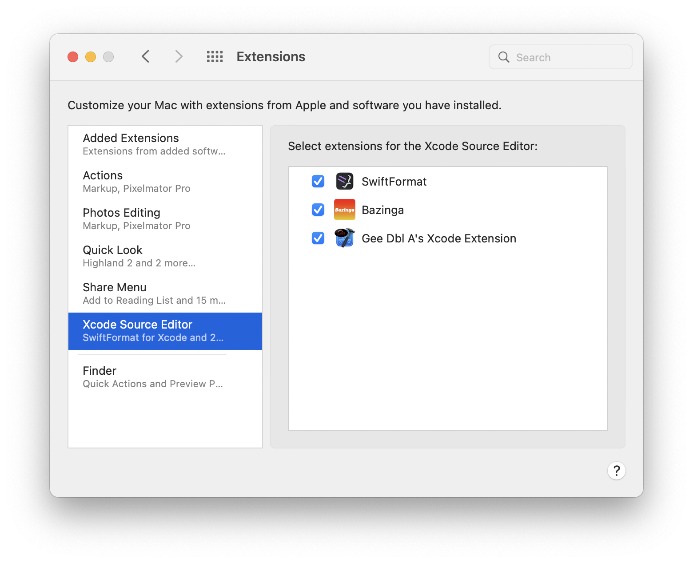

### Gee Dbl A’s Xcode Extension. 
This project is simple test of the Xcode source extension system. Please ensure that the extension is enabled in your System Preference/Settings. 

  

All this extension does right now is provide the insertion of some the comment forms that are part of my usual style and update the modified timestamp of the file header comment that I commonly use in my projects.  
  
* Comment built of dashes that I normally use to separate the parts of a file.
* Box forms of comments built with asterisks, equal signs, or dashes.